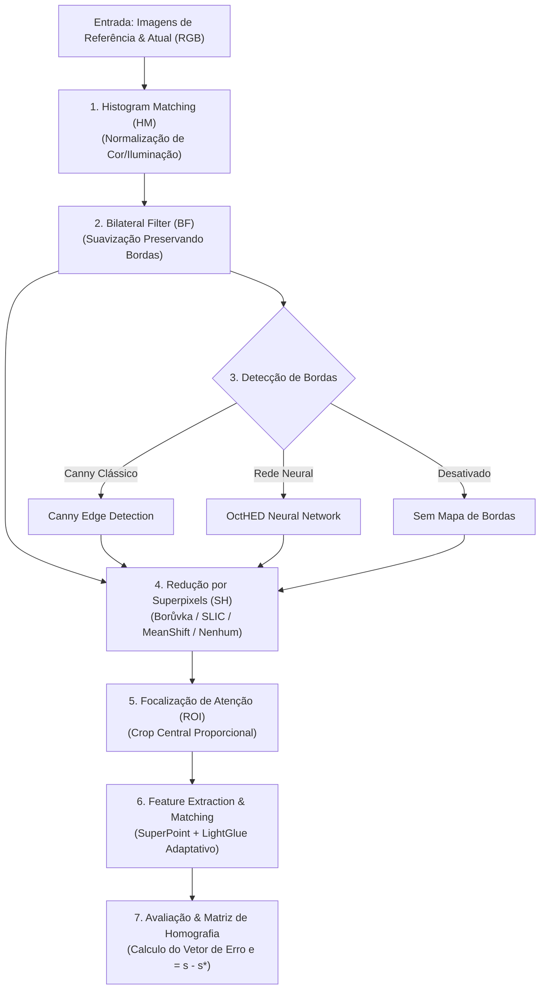

# Framework Modular para Visual Servoing e Extração de Características

Este repositório contém uma arquitetura **modular, extensível e totalmente configurável** para pesquisas e experimentos em **Servoamento Visual (Visual Servoing)** baseado em Visão Computacional e Aprendizado Profundo.

O framework permite construir pipelines flexíveis combinando técnicas de pré-processamento de imagem, detecção de bordas clássica e por redes neurais (**OctHED**), segmentação espacial por superpixels (**Borůvka**, **SLIC**, **MeanShift**), extração/pareamento adaptativo de características (**SuperPoint + LightGlue**) e estimação de Homografia para cálculo de vetores de erro do controlador em malha fechada.

---

## 📐 Arquitetura do Pipeline



---

## 📁 Estrutura do Repositório

```
visual-servoing/
├── config/                          # Arquivos declarativos de configuração (YAML)
│   ├── pipeline_default.yaml        # Configuração de um pipeline individual
│   └── gridsearch_experiment.yaml   # Matriz de hiperparâmetros para varredura em lote
├── octHED/                          # Rede Neural OctHED para detecção de bordas
│   ├── models/                      # Arquiteturas Octave Convolution (OCTHEDFULL)
│   ├── trained_models/              # Pesos pré-treinados (.pt)
│   └── predict.py                   # Módulo importável Predictor / predict_image
├── boruvka-superpixel/              # Implementação C++/Python do algoritmo Borůvka Superpixel
├── src/                             # Código-fonte principal do framework
│   ├── core/                        # Engine central da esteira
│   │   ├── context.py               # Objeto PipelineContext (dados trafegados)
│   │   ├── base_step.py             # Classe base abstrata BaseStep
│   │   ├── registry.py              # Sistema de Registro de Etapas (@register_step)
│   │   └── pipeline.py              # Executor sequencial de etapas
│   ├── steps/                       # Etapas plug-and-play da esteira
│   │   ├── histogram_matching.py    # HistogramMatchingStep (HM)
│   │   ├── bilateral_filter.py      # BilateralFilterStep (BF)
│   │   ├── edge_detection.py        # EdgeDetectionStep (Canny, OctHED, None)
│   │   ├── superpixels.py           # SuperpixelReductionStep (Borůvka, SLIC, MeanShift, None)
│   │   ├── roi.py                   # ROICropStep (Recorte central)
│   │   └── feature_matching.py      # FeatureMatchingStep (SuperPoint + LightGlue)
│   ├── evaluation/                  # Módulos de avaliação quantitativa e geometria
│   │   ├── homography.py            # Estimador de Homografia RANSAC e vetor de erro e = s - s*
│   │   ├── metrics.py               # Cálculo de métricas (Matches, Inliers %, Tempo)
│   │   └── reporter.py              # Gerador de relatórios CSV, JSON e gráficos
│   ├── experiments/                 # Executores de experimentos de alto nível
│   │   ├── run_pipeline.py          # Script para executar 1 pipeline individual
│   │   └── run_gridsearch.py        # Script para executar busca GridSearch automatizada
│   └── legacy/                      # Scripts históricos preservados para referência
├── runs/                            # Diretório de saída automatizado para cada experimento
└── outputs_legacy/                  # Gráficos antigos gerados anteriormente
```

---

## ⚙️ Instalação e Requisitos

O projeto utiliza **Poetry** para gerenciamento de dependências e ambiente virtual Python (3.10+).

```bash
# 1. Clona o repositório
git clone https://github.com/pedrohazevedovm/visual-servoing.git
cd visual-servoing

# 2. Instala as dependências via Poetry
poetry install

# 3. Ativa o ambiente virtual
poetry env activate
```

> **Nota para aceleração de GPU:** Recomenda-se ter suporte ao **PyTorch com CUDA** para execução do LightGlue e OctHED.

---

## 🚀 Como Executar

### 1. Executar um Pipeline Único
Você pode configurar as etapas desejadas no arquivo `config/pipeline_default.yaml` e rodar:

```bash
python src/experiments/run_pipeline.py \
  --config config/pipeline_default.yaml \
  --ref src/assets/vaso_1.jpeg \
  --cur src/assets/vaso_2.jpeg
```

**Parâmetros suportados:**
- `--config`: Caminho para o arquivo YAML de configuração do pipeline.
- `--ref`: Caminho para a imagem de referência ($I^*$).
- `--cur`: Caminho para a imagem atual ($I$).
- `--output`: Pasta de destino para os resultados (opcional; por padrão gera uma pasta timestamped em `runs/`).

---

### 2. Executar um Experimento de GridSearch (Varredura em Lote)
Para testar automaticamente combinações de parâmetros (estudo de ablação), configure a matriz em `config/gridsearch_experiment.yaml` e execute:

```bash
python src/experiments/run_gridsearch.py --config config/gridsearch_experiment.yaml
```

**O que o GridSearch realiza:**
- Avalia todas as combinações do produto cartesiano dos parâmetros (ex: 144 combinações).
- Mede o tempo exato de execução de cada etapa do pipeline em milissegundos.
- Salva o relatório consolidado em `runs/gridsearch_YYYY-MM-DD_HH-MM-SS/gridsearch_summary.csv`.
- Gera os gráficos e detalhes individuais em JSON em subpastas `config_001`, `config_002`, ...

---

## 📝 Exemplo de Arquivo de Configuração YAML

```yaml
pipeline:
  - type: "histogram_matching"
    enabled: true

  - type: "bilateral_filter"
    enabled: true
    params:
      d: 9
      sigmaColor: 75.0
      sigmaSpace: 75.0

  - type: "edge_detection"
    enabled: true
    params:
      method: "octhed" # Opções: 'canny', 'octhed', 'none'

  - type: "superpixel_reduction"
    enabled: true
    params:
      algorithm: "boruvka" # Opções: 'boruvka', 'slic', 'meanshift', 'none'
      n_superpixels: 100

  - type: "roi_crop"
    enabled: true
    params:
      pct_w: 0.3
      pct_h: 0.5

  - type: "feature_matching"
    enabled: true
    params:
      max_num_keypoints: 2048
      filter_threshold: 0.1
```

---

## 🔌 Extensibilidade: Como Adicionar uma Nova Etapa

Para criar um novo módulo/filtro no pipeline, crie uma classe em `src/steps/` usando a interface `BaseStep` e o decorador `@register_step`:

```python
from src.core.base_step import BaseStep
from src.core.context import PipelineContext
from src.core.registry import register_step

@register_step("meu_filtro_customizado")
class MeuFiltroCustomizado(BaseStep):
    def __init__(self, name="meu_filtro_customizado", enabled=True, parametro=1.0, **kwargs):
        super().__init__(name=name, enabled=enabled, **kwargs)
        self.parametro = parametro

    def process(self, context: PipelineContext) -> PipelineContext:
        # Altera context.img_ref_proc ou context.img_cur_proc
        return context
```

Agora basta usar `"meu_filtro_customizado"` diretamente em qualquer arquivo YAML de configuração!

---

## 📊 Métricas Coletadas

Para cada execução, o framework calcula e reporta as seguintes métricas:

| Métrica | Descrição |
| :--- | :--- |
| **`matches_count`** | Número de correspondências brutas de pontos encontradas pelo LightGlue. |
| **`inliers_count`** | Número de correspondências validadas pelo algoritmo RANSAC na homografia. |
| **`inlier_ratio_pct`** | Taxa de aceitação de inliers do RANSAC ($\frac{\text{inliers}}{\text{matches}} \times 100\%$). |
| **`stop_layer`** | Camada adaptativa na qual o LightGlue convergiu e encerrou a inferência. |
| **`servoing_error_norm`** | Norma Euclidiana do vetor de erro visual $\|e\| = \|s - s^*\|$. |
| **`servoing_error_vector`** | Vetor $e \in \mathbb{R}^8$ contendo as 8 componentes independentes da matriz de homografia normalizada. |
| **`corner_error_px`** | Erro médio residual em pixels da projeção dos 4 cantos da imagem (quando comparado ao *ground truth*). |
| **`step_times`** | Perfil de tempo de execução individual para cada etapa (em segundos). |

---

## 📜 Licença
Distribuído sob a licença MIT. Consulte `LICENSE` para mais detalhes.
