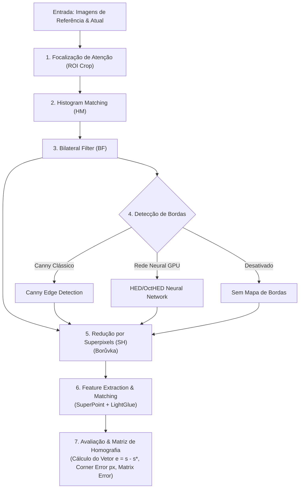

# Framework Modular para Visual Servoing e Extração de Características

Este repositório contém uma arquitetura **modular, extensível e totalmente configurável** para pesquisas e experimentos em **Servoamento Visual (Visual Servoing)** baseado em Visão Computacional e Aprendizado Profundo.

O framework permite construir pipelines flexíveis combinando técnicas de pré-processamento de imagem, recorte ROI antecipado, detecção de bordas avançada por redes neurais otimizadas em GPU (**OctHED**), segmentação espacial por superpixels (**Borůvka**, **SLIC**, **MeanShift**), extração/pareamento adaptativo de características com parada antecipada (**SuperPoint + LightGlue**) e estimação de Homografia para cálculo de vetores de erro do controlador em malha fechada.

---

## 📐 Arquitetura do Pipeline



---

## 🚀 Otimizações de Desempenho e Velocidade Integradas

O pipeline conta com diversas otimizações para reduzir drasticamente o tempo total de processamento em tempo real:

### 1. OctHED (Rede Neural de Bordas Acelerada em GPU)
* **Passe em Lote GPU (Batch GPU Pass)**: As duas imagens ($I^*$ e $I$) são processadas juntas em uma única passada de GPU em lote 4D (`shape: 2x3xHxW`).
* **Pré-processamento Tensor-Nativo**: Troca de canais RGB $\to$ BGR e subtração de média feitas em tensores PyTorch na VRAM, sem ciclos de CPU/NumPy.
* **Precisão Mista Automática (`use_amp: true`)**: Inferência executada sob `torch.amp.autocast('cuda', dtype=torch.float16)` aproveitando Tensor Cores.
* **Truncamento de Estágios Profundos (`lite_mode: true`)**: Corta o Estágio 5 da VGG16 (fusão dos 4 primeiros estágios).
* **Subamostragem Adaptativa (`scale_factor: 0.5`)**: Executa a convolução na resolução reduzida e amplia a saída.
* **Supressão de Não-Máximos em GPU (`use_nms: true`)**: Operador MaxPool 2D na VRAM que afina o mapa de bordas para contornos finos de 1 pixel.

### 2. LightGlue com Parada Antecipada (Early Stopping)
* **Convergência Adaptativa (`depth_confidence: 0.80`)**: Interrompe a inferência dos blocos de atenção assim que a matriz de pareamento atinge convergência (ex: encerra na camada 3 de 9).
* **Controle de Camadas (`n_layers: 6`)**: Limita a quantidade máxima de blocos de atenção no LightGlue.

---

## 📁 Estrutura do Repositório

```
visual-servoing/
├── config/                          # Arquivos declarativos de configuração (YAML)
│   ├── pipeline_default.yaml        # Configuração de um pipeline individual
│   ├── gridsearch_experiment.yaml   # Matriz de hiperparâmetros para varredura em lote
│   └── gridsearch_superpixels.yaml  # Varredura específica de n_superpixels e compactness
├── octHED/                          # Rede Neural OctHED para detecção de bordas
│   ├── models/                      # Arquiteturas Octave Convolution (OCTHEDFULL, HED)
│   ├── trained_models/              # Pesos pré-treinados (.pt)
│   └── predict.py                   # Módulo Predictor (Batch, AMP, Lite Mode, NMS)
├── boruvka-superpixel/              # Implementação C++/Python do algoritmo Borůvka Superpixel
├── src/                             # Código-fonte principal do framework
│   ├── core/                        # Engine central da esteira
│   │   ├── context.py               # Objeto PipelineContext (dados trafegados)
│   │   ├── base_step.py             # Classe base abstrata BaseStep
│   │   ├── registry.py              # Sistema de Registro de Etapas (@register_step)
│   │   ├── pipeline.py              # Executor sequencial de etapas
│   │   └── synthetic.py             # Gerador de transformações sintéticas e Ground Truth (H_gt)
│   ├── steps/                       # Etapas plug-and-play da esteira
│   │   ├── roi.py                   # ROICropStep (Recorte central proporcional)
│   │   ├── histogram_matching.py    # HistogramMatchingStep (HM)
│   │   ├── bilateral_filter.py      # BilateralFilterStep (BF)
│   │   ├── edge_detection.py        # EdgeDetectionStep (Canny, OctHED, None)
│   │   ├── superpixels.py           # SuperpixelReductionStep (Borůvka, SLIC, MeanShift, None)
│   │   └── feature_matching.py      # FeatureMatchingStep (SuperPoint + LightGlue)
│   ├── evaluation/                  # Módulos de avaliação quantitativa e geometria
│   │   ├── homography.py            # Estimador de Homografia RANSAC e vetor e = s - s*
│   │   ├── metrics.py               # Cálculo de métricas (Matches, Inliers %, Corner Error, Matrix Error)
│   │   ├── reporter.py              # Gerador de relatórios CSV, JSON e gráficos
│   │   └── wandb_logger.py          # Integração com Weights & Biases (wandb.ai)
│   └── experiments/                 # Executores de experimentos de alto nível
│       ├── run_pipeline.py          # Script para executar 1 pipeline individual
│       └── run_gridsearch.py        # Script para executar busca GridSearch automatizada
├── runs/                            # Diretório de saída automatizado para cada experimento
└── outputs_legacy/                  # Gráficos antigos gerados anteriormente
```

---

## ⚙️ Instalação e Requisitos

O projeto utiliza **Poetry** para gerenciamento de dependências e ambiente virtual Python (3.10+).

```bash
# 1. Clona o repositório
git clone https://github.com/pedrohazevedovm/visual-servoing.git
cd visual-servoing

# 2. Instala as dependências via Poetry
poetry install

# 3. Ativa o ambiente virtual
poetry env activate
```

> **Nota para aceleração de GPU:** Recomenda-se ter suporte ao **PyTorch com CUDA** para execução do LightGlue e OctHED em velocidade máxima.

---

## 🚀 Como Executar

### 1. Executar um Pipeline Único
Você pode configurar as etapas desejadas no arquivo `config/pipeline_default.yaml` e rodar:

```bash
python src/experiments/run_pipeline.py \
  --config config/pipeline_default.yaml \
  --ref src/assets/vaso_1.jpeg \
  --cur src/assets/vaso_2.jpeg
```

**Parâmetros suportados:**
- `--config`: Caminho para o arquivo YAML de configuração do pipeline.
- `--ref`: Caminho para a imagem de referência ($I^*$).
- `--cur`: Caminho para a imagem atual ($I$).
- `--output`: Pasta de destino para os resultados (opcional; por padrão gera uma pasta timestamped em `runs/`).

---

### 2. Avaliação com Imagem Única e Ground Truth Sintético ($H_{gt}$)
Para avaliar a acurácia quantitativa do pipeline contra a matriz de Homografia real obtida de forma matemática controlada (**Ground Truth $H_{gt}$**), você pode fornecer **uma única imagem** e aplicar transformações sintéticas (rotação, escala e translação):

```bash
python src/experiments/run_pipeline.py \
  --config config/pipeline_default.yaml \
  --single src/assets/vaso_1.jpeg \
  --angle 15.0 \
  --scale 1.05 \
  --tx 30.0 \
  --ty -20.0
```

**Parâmetros para modo sintético:**
- `--single`: Caminho para a imagem única de entrada.
- `--angle`: Ângulo de rotação em graus (ex: `15.0`).
- `--scale`: Fator de escala geométrica (ex: `1.05`).
- `--tx`: Translação horizontal em pixels (ex: `30.0`).
- `--ty`: Translação vertical em pixels (ex: `-20.0`).

Ao executar neste modo, a métrica **`Corner Error (px)`** é calculada medindo a distância real em pixels entre a Homografia estimada pelo pipeline e a transformação matemática Ground Truth.

---

### 3. Executar um Experimento de GridSearch (Varredura em Lote)
Para testar automaticamente combinações de parâmetros (estudo de ablação), configure a matriz em `config/gridsearch_experiment.yaml` ou `config/gridsearch_superpixels.yaml` e execute:

```bash
python src/experiments/run_gridsearch.py --config config/gridsearch_experiment.yaml
```

**O que o GridSearch realiza:**
- Avalia todas as combinações do produto cartesiano dos parâmetros.
- Mede o tempo exato de execução de cada etapa do pipeline em milissegundos.
- Salva o relatório consolidado em `runs/gridsearch_YYYY-MM-DD_HH-MM-SS/gridsearch_summary.csv`.
- Gera os gráficos e detalhes individuais em JSON nas subpastas `config_001`, `config_002`, ...

---

## 📈 Registro e Comparação de Runs no Weights & Biases (wandb.ai)

O framework conta com suporte nativo ao **Weights & Biases (`wandb.ai`)** para salvar, acompanhar, visualizar e comparar experimentos de maneira estruturada.

### 🌟 Recursos de Integração no W&B:
* **Hiperparâmetros Estruturados (`wandb.config`)**: Registra todas as configurações de pipeline, etapas ativas e parâmetros de warping sintético (`angle`, `scale`, `tx`, `ty`).
* **Métricas Escalares & Profiling de Tempo (`step_times/*`)**: Acompanha número de correspondências, inliers %, erro da homografia, erro dos cantos em pixels e o tempo individual consumido por cada etapa do pipeline.
* **Imagens & Visualizações (`wandb.Image`)**: Salva o gráfico gerado com os pontos correspondentes e a caixa delimitadora transformada.
* **Upload de Artefatos Versionados (`wandb.Artifact`)**: Armazena os diretórios de saída da execução contendo o arquivo `metrics.json` e a imagem `pipeline_result.png`.
* **Agrupamento & Matriz de Comparação em GridSearch**: Agrupa execuções de um mesmo GridSearch sob o mesmo grupo (`group`) e cria uma **`wandb.Table`** consolidada com a comparação lado a lado de todas as combinações.

### 🚀 Como Ativar o Logging no W&B:

#### 1. Via Flag da Linha de Comando (`--wandb`):
```bash
# Execução individual com logging no W&B
poetry run python src/experiments/run_pipeline.py \
  --single src/assets/vaso_1.jpeg \
  --angle 15 \
  --wandb \
  --wandb-project "visual-servoing" \
  --wandb-entity "phavm-ufpe"

# GridSearch com logging e agrupamento no W&B
poetry run python src/experiments/run_gridsearch.py \
  --config config/gridsearch_experiment.yaml \
  --wandb
```

#### 2. Via Arquivo de Configuração YAML:
Adicione ou ajuste o bloco `wandb:` no arquivo de configuração:
```yaml
wandb:
  enabled: true
  project: "visual-servoing"
  entity: "phavm-ufpe"
```

#### 3. Parâmetros CLI do W&B:
* `--wandb`: Ativa o envio para o Weights & Biases.
* `--wandb-project`: Nome do projeto no W&B (padrão: `"visual-servoing"`).
* `--wandb-entity`: Usuário ou time no W&B (ex: `"phavm-ufpe"`).
* `--wandb-group`: Nome do grupo para agrupar runs relacionados no dashboard.
* `--wandb-name`: Nome exibido para a run.
* `--wandb-mode`: Modo de execução do W&B (`online`, `offline`, `disabled`).

---

## 📝 Exemplo de Arquivo de Configuração YAML

```yaml
pipeline:
  - type: "roi_crop"
    enabled: false
    params:
      pct_w: 0.3
      pct_h: 0.5

  - type: "histogram_matching"
    enabled: false

  - type: "bilateral_filter"
    enabled: true
    params:
      d: 9
      sigmaColor: 75.0
      sigmaSpace: 75.0

  - type: "edge_detection"
    enabled: true
    params:
      method: "octhed" # Opções: 'canny', 'octhed', 'none'
      scale_factor: 1.0
      use_amp: true
      lite_mode: true
      use_nms: false

  - type: "superpixel_reduction"
    enabled: true
    params:
      algorithm: "boruvka" # Opções: 'boruvka', 'slic', 'meanshift', 'none'
      n_superpixels: 50
      compactness: 10.0

  - type: "feature_matching"
    enabled: true
    params:
      max_num_keypoints: 512
      filter_threshold: 0.1
      depth_confidence: 0.80
      width_confidence: 0.90
      n_layers: 6
      mp: false
```

---

## 🔌 Extensibilidade: Como Adicionar uma Nova Etapa

Para criar um novo módulo/filtro no pipeline, crie uma classe em `src/steps/` usando a interface `BaseStep` e o decorador `@register_step`:

```python
from src.core.base_step import BaseStep
from src.core.context import PipelineContext
from src.core.registry import register_step

@register_step("meu_filtro_customizado")
class MeuFiltroCustomizado(BaseStep):
    def __init__(self, name="meu_filtro_customizado", enabled=True, parametro=1.0, **kwargs):
        super().__init__(name=name, enabled=enabled, **kwargs)
        self.parametro = parametro

    def process(self, context: PipelineContext) -> PipelineContext:
        # Altera context.img_ref_proc ou context.img_cur_proc
        return context
```

Agora basta usar `"meu_filtro_customizado"` diretamente em qualquer arquivo YAML de configuração!

---

## 📊 Métricas Coletadas

Para cada execução, o framework calcula e reporta as seguintes métricas no relatório e no `metrics.json`:

| Métrica | Descrição |
| :--- | :--- |
| **`matches_count`** | Número de correspondências brutas de pontos encontradas pelo LightGlue. |
| **`inliers_count`** | Número de correspondências validadas pelo algoritmo RANSAC na homografia. |
| **`inlier_ratio_pct`** | Taxa de aceitação de inliers do RANSAC ($\frac{\text{inliers}}{\text{matches}} \times 100\%$). |
| **`stop_layer`** | Camada adaptativa na qual o LightGlue convergiu e encerrou a inferência. |
| **`servoing_error_norm`** | Norma Euclidiana do vetor de erro visual $\|e\| = \|s - s^*\|$. |
| **`servoing_error_vector`** | Vetor $e \in \mathbb{R}^8$ contendo as 8 componentes independentes da matriz de homografia normalizada. |
| **`corner_error_px`** | Erro médio residual em pixels da projeção dos 4 cantos da imagem (quando comparado ao *ground truth* $H_{gt}$). |
| **`homography_matrix_error`** | Diferença matricial em norma de Frobenius entre a Homografia estimada e a real $\|H_{est} - H_{gt}\|_F$. |
| **`servoing_error_diff_norm`** | Diferença entre o vetor de erro do servoamento estimado e o ideal $\|e_{est} - e_{gt}\|$. |
| **`total_time_sec`** | Tempo total de execução da esteira do pipeline (em segundos). |
| **`step_times`** | Perfil de tempo de execução individual para cada etapa (em segundos). |

---

## 📜 Licença
Distribuído sob a licença MIT. Consulte `LICENSE` para mais detalhes.
